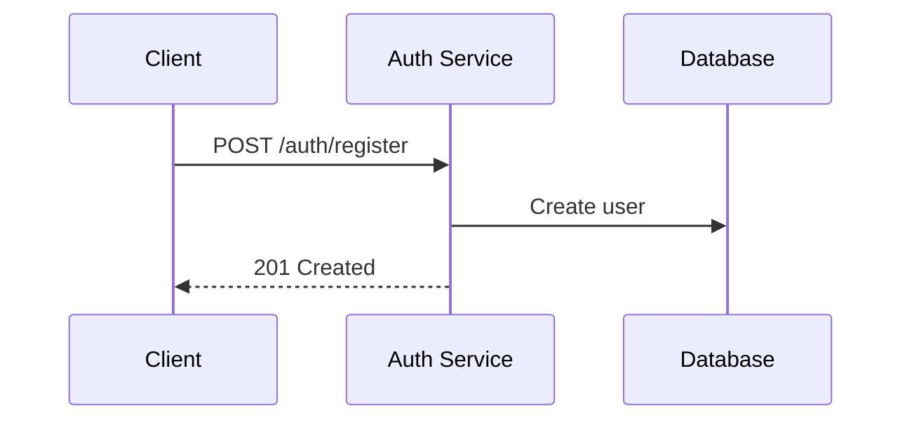
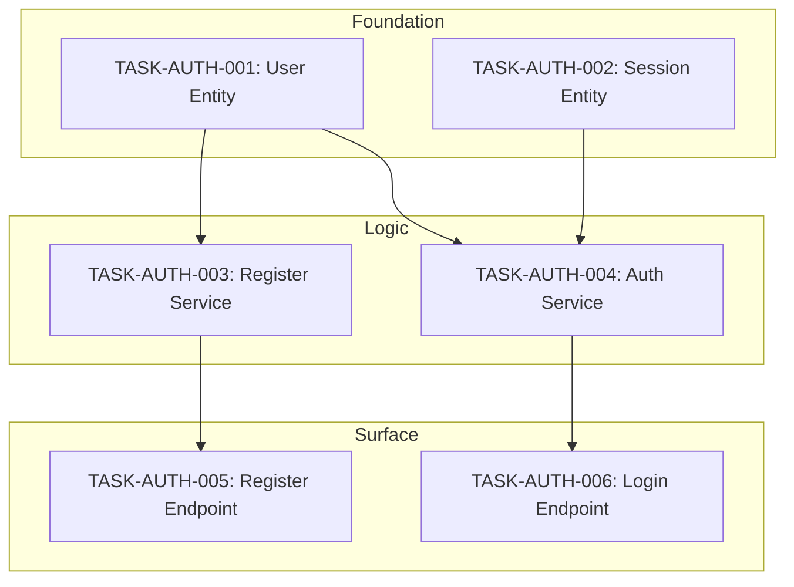

# AI-Agent Specification Development Guide

## Complete Framework for Translating PRDs into Machine-Executable Specifications and Sequential Tasks

---

## Part 1: Foundation Principles

### 1.1 Core Philosophy

Specifications for AI agents are **executable blueprints**—precise instruction sets eliminating ambiguity.

**Three Governing Principles:**
- **Intent as truth**: Capture *what* and *why*, not *how*. Implementation details → technical specs.
- **Machine-first readable**: Explicit structure, unambiguous language, predictable formatting for LLM parsing.
- **Context persistence**: Self-contained specs enable zero-context agent resumption.

### 1.2 Specification Hierarchy

```
Level 1: Constitution (immutable rules)
Level 2: Functional Specs (what to build)
Level 3: Technical Specs (how to build)
Level 4: Task Specs (atomic work units)
Level 5: Context Files (live state)
```

PRDs feed Levels 2-4. Constitution and Context provide guardrails and memory.

### 1.3 Two-Phase Workflow

**Phase A: Specification Creation**
Transform PRDs into complete specs (Functional → Technical). Document *what* to build.

**Phase B: Task Generation**
Decompose approved specs into atomic, sequential tasks. Create *deterministic assembly line* where task completion = full implementation.

Both phases essential. Specs without tasks = implementation by chance. Tasks without specs = missing context.

---

## Part 2: Breaking Down a PRD

### 2.1 Decomposition Process

**5 Steps:**
1. **Extract User Journeys**: Identify user types, triggers, success criteria, failure modes
2. **Identify Functional Domains**: Auth, CRUD, workflows, integrations, analytics, admin
3. **Extract Requirements with IDs**: Pattern `[REQ-DOMAIN-##]` enables traceability, compliance checking, clear communication
4. **Identify Non-Functional Requirements**: Surface performance, security, reliability, accessibility, compliance from implicit PRD language
5. **Surface Edge Cases**: For each requirement ask: What fails? What are boundaries? Invalid inputs?

### 2.2 PRD Decomposition Template

```markdown
## PRD Analysis: [Feature Name]

### User Types
| Type | Description | Permission |
|------|-------------|------------|

### User Journeys
1. [Journey]: [Description]

### Functional Domains
- [ ] Domain 1
- [ ] Domain 2

### Requirements
| ID | Domain | Requirement | Source |
|----|--------|-------------|--------|

### Non-Functional Requirements
| ID | Category | Requirement | Metric |
|----|----------|-------------|--------|

### Edge Cases
| Related Req | Scenario | Expected Behavior |
|-------------|----------|-------------------|

### Open Questions
1. [Question for stakeholders]
```

---

## Part 3: Specification Documents

### 3.1 File Organization

```
project-root/
├── .ai/                          # AI memory
│   ├── activeContext.md          # Session state
│   ├── decisionLog.md            # Architectural decisions
│   └── progress.md               # Roadmap status
├── specs/
│   ├── constitution.md           # Immutable rules
│   ├── functional/
│   │   ├── _index.md
│   │   └── [domain].md
│   ├── technical/
│   │   ├── _index.md
│   │   ├── architecture.md
│   │   ├── data-models.md
│   │   └── api-contracts.md
│   └── tasks/
│       ├── _index.md             # Dependency graph
│       ├── _traceability.md      # Coverage matrix
│       └── TASK-[DOMAIN]-[###].md
└── docs/diagrams/
```

### 3.2 Constitution Template (Condensed)

```xml
<constitution version="1.0">
<metadata>
  <project_name>Name</project_name>
  <spec_version>1.0.0</spec_version>
</metadata>

<tech_stack>
  <language version="X.X">Language</language>
  <framework version="X.X">Framework</framework>
  <database>DB</database>
  <required_libraries>
    <library version="X.X">Lib</library>
  </required_libraries>
</tech_stack>

<directory_structure>
<!-- tree -L 2 -I 'node_modules|.git' output -->
</directory_structure>

<coding_standards>
  <naming_conventions>
    <files>kebab-case files, PascalCase components</files>
    <variables>camelCase variables, SCREAMING_SNAKE constants</variables>
    <functions>camelCase, verb-first (getUserById)</functions>
  </naming_conventions>
  <file_organization>
    <rule>One component per file</rule>
    <rule>Co-locate tests: [name].test.ts</rule>
    <rule>Shared utilities: src/utils/</rule>
  </file_organization>
  <error_handling>
    <rule>Explicit error handling for async operations</rule>
    <rule>Log errors with context before re-throwing</rule>
    <rule>User-facing errors use ErrorBoundary</rule>
  </error_handling>
</coding_standards>

<anti_patterns>
  <forbidden>
    <item reason="Deprecated">No var; use const/let</item>
    <item reason="Security">No secrets in code; use env vars</item>
    <item reason="Consistency">Check existing utils/ before creating new</item>
    <item reason="Maintainability">No magic numbers; define constants</item>
    <item reason="Testing">Stub data in tests/fixtures/, not inline</item>
    <item reason="Architecture">No direct API calls from components; use services</item>
  </forbidden>
</anti_patterns>

<security_requirements>
  <rule id="SEC-01">Validate and sanitize all user input</rule>
  <rule id="SEC-02">Auth tokens expire after 24h</rule>
  <rule id="SEC-03">Passwords: min 12 chars with complexity</rule>
  <rule id="SEC-04">All endpoints require auth except /health, /auth/*</rule>
</security_requirements>

<performance_budgets>
  <metric name="initial_load">< 3s on 3G</metric>
  <metric name="api_response">< 200ms p95</metric>
  <metric name="database_query">< 100ms p95</metric>
</performance_budgets>

<testing_requirements>
  <coverage_minimum>80% line coverage</coverage_minimum>
  <required_tests>
    <test_type>Unit tests for business logic</test_type>
    <test_type>Integration tests for API endpoints</test_type>
    <test_type>E2E tests for critical journeys</test_type>
  </required_tests>
</testing_requirements>
</constitution>
```

### 3.3 Functional Spec Template

```xml
<functional_spec id="SPEC-AUTH" version="1.0">
<metadata>
  <title>Authentication System</title>
  <status>approved</status>
  <owner>Team</owner>
  <last_updated>YYYY-MM-DD</last_updated>
  <related_specs><spec_ref>SPEC-USERS</spec_ref></related_specs>
</metadata>

<overview>
What this feature/domain accomplishes and why it exists.
Problem solved? Who benefits?
</overview>

<user_stories>
<story id="US-AUTH-01" priority="must-have">
  <narrative>
    As a [user type]
    I want to [action]
    So that [benefit]
  </narrative>
  <acceptance_criteria>
    <criterion id="AC-01">
      <given>Context</given>
      <when>Action</when>
      <then>Expected result</then>
    </criterion>
  </acceptance_criteria>
</story>
</user_stories>

<requirements>
<requirement id="REQ-AUTH-01" story_ref="US-AUTH-01" priority="must">
  <description>Requirement text</description>
  <rationale>Why this is needed</rationale>
</requirement>
</requirements>

<edge_cases>
<edge_case id="EC-AUTH-01" req_ref="REQ-AUTH-01">
  <scenario>Edge case description</scenario>
  <expected_behavior>How system should respond</expected_behavior>
</edge_case>
</edge_cases>

<error_states>
<error id="ERR-AUTH-01" http_code="400">
  <condition>Error trigger</condition>
  <message>User-visible message</message>
  <recovery>Recovery action</recovery>
</error>
</error_states>

<test_plan>
<test_case id="TC-AUTH-01" type="unit" req_ref="REQ-AUTH-01">
  <description>Test description</description>
  <inputs>["test", "data"]</inputs>
  <expected>Expected outcome</expected>
</test_case>
</test_plan>
</functional_spec>
```

### 3.4 Technical Spec Template

```xml
<technical_spec id="TECH-AUTH" version="1.0" implements="SPEC-AUTH">
<metadata>
  <title>Authentication Implementation</title>
  <status>approved</status>
  <last_updated>YYYY-MM-DD</last_updated>
</metadata>

<architecture_diagram>

</architecture_diagram>

<data_models>
<model name="User">
  <field name="id" type="UUID" constraints="primary_key, auto"/>
  <field name="email" type="string(255)" constraints="unique, not_null, indexed"/>
  <field name="password_hash" type="string(60)" constraints="not_null"/>
  <field name="email_verified" type="boolean" constraints="default: false"/>
  <field name="created_at" type="timestamp" constraints="not_null, auto"/>
</model>
</data_models>

<api_contracts>
<endpoint path="/auth/register" method="POST">
  <implements>REQ-AUTH-01, REQ-AUTH-02</implements>
  <request_body>
    email: string (required, email format)
    password: string (required, min 12 chars)
    name: string (required, 1-100 chars)
  </request_body>
  <responses>
    201: {id, email, name, message}
    400: {error: "validation_error", details: [{field, message}]}
    409: {error: "email_exists", message}
  </responses>
</endpoint>
</api_contracts>

<component_contracts>
<component name="AuthService" path="src/services/auth.service.ts">
  <method name="registerUser">
    <signature>async registerUser(dto: RegisterDto): Promise&lt;User&gt;</signature>
    <implements>REQ-AUTH-01, REQ-AUTH-02</implements>
    <behavior>
      1. Validate email format
      2. Check email uniqueness
      3. Validate password strength
      4. Hash password with bcrypt
      5. Create user record
      6. Queue verification email
      7. Return user (without password_hash)
    </behavior>
    <throws>ValidationError, ConflictError, WeakPasswordError</throws>
  </method>
</component>
</component_contracts>

<implementation_notes>
<note category="security">JWT secret from JWT_SECRET env var. Min 256-bit key.</note>
<note category="performance">Email uniqueness via DB constraint. Index on (email, email_verified).</note>
<note category="integration">Email service async via message queue. Don't await in registration.</note>
</implementation_notes>
</technical_spec>
```

---

## Part 4: Task Generation — Deterministic Assembly Line

> **CRITICAL:** Apply AFTER all specs complete and approved. Tasks are *output* of specs, not replacement.

### 4.1 Core Principle: Inside-Out, Bottom-Up

**DO NOT slice by "Feature."** Slice by **Architectural Layer.**

Task "Build Login" → agent writes Database, Service, Controller simultaneously → context overflow, hallucinated imports, broken dependencies.

**Enforce Strict Generation Order:**

```
┌─────────────────────────────────────────────────────────┐
│ LAYER 1: DATA & TYPES (Foundation)                     │
│ Source: <data_models>, DTOs from <api_contracts>       │
│ Output: Migrations, ORM entities, TS interfaces        │
│ Why: Zero dependencies. Must exist before imports.     │
└─────────────────────────────────────────────────────────┘
                        ↓
┌─────────────────────────────────────────────────────────┐
│ LAYER 2: PURE BUSINESS LOGIC (Core)                    │
│ Source: <component_contracts> (Services)               │
│ Output: Service classes, business logic, unit tests    │
│ Why: Depends on Layer 1 only. Isolated unit testing.   │
└─────────────────────────────────────────────────────────┘
                        ↓
┌─────────────────────────────────────────────────────────┐
│ LAYER 3: INTERFACE & EXPOSURE (Surface)                │
│ Source: <api_contracts> (Controllers/Resolvers)        │
│ Output: Controllers, routes, integration tests         │
│ Why: Depends on Layer 2. Wires everything together.    │
└─────────────────────────────────────────────────────────┘
```

**Iron Rule:** Task N cannot reference files created in Task N+1 or later.

### 4.2 Task Generator Prompt

**Use LLM to generate task specs from technical spec.**

```xml
<task_generation_prompt>
Lead Architect: Read specs/technical/[domain].md and generate atomic task_spec files.

<rules>
<granularity>
One task = One conceptual change.
✓ "Create User Entity and Migration"
✓ "Implement RegisterUser Service Method"
✓ "Create Registration Endpoint with Tests"
✗ "Build entire auth system"
</granularity>

<dependency_ordering>
STRICT ORDER:
1. Task N cannot reference files from Task N+1
2. Database models/types FIRST
3. Repository/Service layer SECOND
4. Controllers/API layer LAST

Within layers: Base types → Extended types. Shared utils → Consumers.
</dependency_ordering>

<testing_requirement>
Every Logic/API task MUST include test file creation.
Tests ship with implementation, not separate.
</testing_requirement>

<naming_convention>
Explicit sequence: TASK-[DOMAIN]-[###]
Example: TASK-AUTH-001, TASK-AUTH-002
</naming_convention>

<layer_assignment>
Tag each task:
- layer="foundation" (data models, types, migrations)
- layer="logic" (services, business rules)
- layer="surface" (controllers, routes, UI)
</layer_assignment>
</rules>

<output_format>
Generate full Task Specification Template content for each sequential task.
Include: input_context_files, definition_of_done, files_to_create/modify
</output_format>
</task_generation_prompt>
```

### 4.3 Task Specification Template

```xml
<task_spec id="TASK-AUTH-001" version="1.0">
<metadata>
  <title>Create User Entity and Database Migration</title>
  <status>ready</status>
  <layer>foundation</layer>
  <sequence>1</sequence>
  <implements>
    <requirement_ref>REQ-AUTH-01</requirement_ref>
    <requirement_ref>REQ-AUTH-02</requirement_ref>
  </implements>
  <depends_on><!-- Empty for first task --></depends_on>
  <estimated_complexity>low</estimated_complexity>
</metadata>

<context>
Foundation task for auth system. Creates User entity and migration.
All subsequent auth tasks depend on this. No prior auth tasks exist.
</context>

<input_context_files>
  <!-- List ONLY files agent needs for THIS task -->
  <file purpose="schema_definition">specs/technical/auth.md#data_models</file>
  <file purpose="naming_conventions">specs/constitution.md#coding_standards</file>
  <file purpose="existing_entities">src/database/entities/</file>
</input_context_files>

<prerequisites>
  <check>Database connection configured</check>
  <check>TypeORM installed and configured</check>
  <check>Migration runner available</check>
</prerequisites>

<scope>
  <in_scope>
    - Create User entity matching tech spec
    - Create database migration for users table
    - Create TypeScript interfaces for User
  </in_scope>
  <out_of_scope>
    - Session entity (TASK-AUTH-002)
    - AuthService (TASK-AUTH-003)
    - API endpoints (TASK-AUTH-005+)
  </out_of_scope>
</scope>

<definition_of_done>
  <signatures>
    <!-- Exact signatures agent must produce -->
    <signature file="src/database/entities/user.entity.ts">
      export class User {
        id: string;
        email: string;
        passwordHash: string;
        name: string;
        emailVerified: boolean;
        createdAt: Date;
        updatedAt: Date;
        lockedUntil: Date | null;
        failedLoginAttempts: number;
      }
    </signature>
    <signature file="src/types/user.types.ts">
      export interface IUser { ... }
      export type CreateUserDto = Pick&lt;IUser, 'email' | 'name'&gt; & { password: string };
    </signature>
  </signatures>

  <constraints>
    - UUID for primary key (not auto-increment)
    - All fields from tech spec data model
    - NO 'any' type anywhere
    - Follow constitution naming conventions
    - Migration reversible (include down() method)
  </constraints>

  <verification>
    - npm run migration:run (no errors)
    - npm run migration:revert (no errors)
    - Entity compiles without TS errors
  </verification>
</definition_of_done>

<pseudo_code>
User Entity (src/database/entities/user.entity.ts):
  @Entity('users')
  class User:
    @PrimaryGeneratedColumn('uuid') id
    @Column({ unique: true }) email
    @Column() passwordHash
    @Column() name
    @Column({ default: false }) emailVerified
    @CreateDateColumn() createdAt
    @UpdateDateColumn() updatedAt
    @Column({ nullable: true }) lockedUntil
    @Column({ default: 0 }) failedLoginAttempts

Migration:
  up(): CREATE TABLE users with columns, unique index on email
  down(): DROP TABLE users
</pseudo_code>

<files_to_create>
  <file path="src/database/entities/user.entity.ts">User entity with TypeORM decorators</file>
  <file path="src/types/user.types.ts">TypeScript interfaces and DTOs</file>
  <file path="src/database/migrations/YYYYMMDDHHMMSS-CreateUsersTable.ts">Migration file</file>
</files_to_create>

<files_to_modify>
  <file path="src/database/entities/index.ts">Export User entity</file>
</files_to_modify>

<validation_criteria>
  <criterion>Migration executes successfully</criterion>
  <criterion>Migration can be reverted</criterion>
  <criterion>User entity matches tech spec exactly</criterion>
  <criterion>No TypeScript compilation errors</criterion>
  <criterion>All fields have correct types and constraints</criterion>
</validation_criteria>

<test_commands>
  <command>npm run migration:run</command>
  <command>npm run migration:revert</command>
  <command>npm run type-check</command>
</test_commands>
</task_spec>
```

### 4.4 Traceability Matrix

**Most common failure: missing requirements.** Run coverage check before approving tasks.

Create `specs/tasks/_traceability.md`:

```markdown
# Task Traceability Matrix

## Coverage: SPEC-AUTH → TASK-AUTH-*

| Tech Spec Item | Type | Task ID | ✓ |
|----------------|------|---------|---|
| Model: User | data_model | TASK-AUTH-001 | ✓ |
| Model: Session | data_model | TASK-AUTH-002 | ✓ |
| Service: registerUser | method | TASK-AUTH-003 | ✓ |
| API: POST /auth/register | endpoint | TASK-AUTH-005 | ✓ |
| Error: ERR-AUTH-01 | error_state | TASK-AUTH-005 | ✓ |

## Uncovered Items
(none)

## Validation Checklist
- [x] All data models have tasks
- [x] All service methods have tasks
- [x] All API endpoints have tasks
- [x] All error states handled
- [x] Task dependencies form valid DAG (no cycles)
- [x] Layer ordering correct (foundation → logic → surface)
```

**Empty "Task ID" column = INCOMPLETE task generation.**

### 4.5 Task Dependency Graph

Create `specs/tasks/_index.md`:

```markdown
# Task Index: Authentication Domain

## Dependency Graph



## Execution Order

| # | Task ID | Title | Layer | Depends On |
|---|---------|-------|-------|------------|
| 1 | TASK-AUTH-001 | User Entity | foundation | — |
| 2 | TASK-AUTH-002 | Session Entity | foundation | TASK-AUTH-001 |
| 3 | TASK-AUTH-003 | Register Service | logic | TASK-AUTH-001 |
| 4 | TASK-AUTH-004 | Auth Service | logic | TASK-AUTH-001, 002 |
| 5 | TASK-AUTH-005 | Register Endpoint | surface | TASK-AUTH-003 |
| 6 | TASK-AUTH-006 | Login Endpoint | surface | TASK-AUTH-004 |

## Status

| Task | Status | Completed | Verified |
|------|--------|-----------|----------|
| TASK-AUTH-001 | ✓ Complete | 2024-01-15 | ✓ |
| TASK-AUTH-002 | ✓ Complete | 2024-01-15 | ✓ |
| TASK-AUTH-003 | 🔄 In Progress | — | — |
| TASK-AUTH-004 | ⏳ Blocked | — | — |

**Progress: 2/6 tasks (33%)**
```

### 4.6 Task Generation Checklist

Before executing tasks:

**Completeness**
- [ ] All tech spec items have tasks
- [ ] Traceability matrix complete
- [ ] Every service method has task
- [ ] Every API endpoint has task
- [ ] All error states covered

**Ordering**
- [ ] Foundation → Logic → Surface
- [ ] Dependencies satisfied within layers
- [ ] No task references files from later tasks

**Quality**
- [ ] Each task truly atomic (one change)
- [ ] Input context files minimal and correct
- [ ] Definition of done has exact signatures
- [ ] Constraints reference constitution
- [ ] Test commands specified

**Structure**
- [ ] Named TASK-[DOMAIN]-[###]
- [ ] Sequence numbers gapless
- [ ] No cycles in dependency graph
- [ ] _index.md complete
- [ ] _traceability.md passes checks

---

## Part 5: Context Files (Memory Bank)

### 5.1 Active Context

AI's "working memory" for current session. Read at start, update at end.

```markdown
# Active Context

**Last Updated:** YYYY-MM-DD HH:MM by [human/agent]

## Current Focus
Brief description of current work.

## Active Task
**Task:** TASK-AUTH-001
**Status:** In Progress
**Started:** YYYY-MM-DD

## Recent Decisions
- [Date] Decision about X because Y

## Current Blockers
- [ ] Waiting on API credentials
- [x] ~~DB connection issue~~ (resolved)

## Open Questions
1. Use refresh tokens? (Awaiting input)

## Next Steps
1. Complete TASK-AUTH-001
2. Begin TASK-AUTH-002

## Session Notes
Observations, attempts, context to persist.
```

### 5.2 Decision Log

Immutable architectural decisions. Prevents re-litigating settled debates.

```markdown
# Decision Log

## DEC-001: Password Hashing Algorithm
**Date:** YYYY-MM-DD | **Status:** Final
**Decision:** bcrypt with cost factor 12
**Context:** Choose between bcrypt, Argon2, scrypt
**Rationale:** Industry standard, proven track record, excellent library support. Cost 12 balances security/performance.
**Consequences:** ~250ms per operation. Cannot easily increase cost without rehashing.

---

## DEC-002: JWT vs Session Tokens
**Date:** YYYY-MM-DD | **Status:** Final
**Decision:** JWT with short expiration + refresh tokens
**Rationale:** Enable horizontal scaling without shared session storage. Refresh tokens allow revocation.
```

### 5.3 Progress Tracker

```markdown
# Implementation Progress

## Phase 1: Foundation
- [x] TASK-DB-001: Database schema
- [x] TASK-CONFIG-001: Environment config
- [ ] TASK-AUTH-001: Registration ← CURRENT
- [ ] TASK-AUTH-002: Login

## Phase 2: Core Features
- [ ] TASK-USER-001: User profiles
- [ ] TASK-USER-002: Password reset

**Completion: 2/15 tasks (13%)**
```

---

## Part 6: AI Agent Instructions

### 6.1 Agent Workflow Protocol

Include in system prompt or dedicated agent instruction file.

```xml
<agent_protocol>

<session_start>
Before implementation:
1. Read .ai/activeContext.md (current state)
2. Read .ai/decisionLog.md (settled decisions)
3. Read specs/constitution.md (immutable rules)
4. Identify current task from .ai/progress.md
5. Read relevant functional/technical specs
6. Read specific task spec
7. Verify prerequisites met
</session_start>

<task_execution>
For each task:
1. Read ONLY files in <input_context_files>
2. Review <definition_of_done> for exact signatures
3. Verify understanding of <constraints>
4. Generate pseudo-code if not approved
5. Implement matching exact signatures
6. Create tests (same task, not separate)
7. Run all <test_commands>
8. Verify against <validation_criteria>
</task_execution>

<before_coding>
For logic > 10 lines:
1. Write pseudo-code in response
2. Wait for human approval
3. Update task spec's pseudo_code if approach changes
</before_coding>

<file_operations>
Before creating files:
1. Check <directory_structure> in constitution
2. Search for similar existing files
3. If exists, extend rather than duplicate

Before modifying:
1. Read entire file first
2. Understand structure and patterns
3. Make minimal changes
</file_operations>

<dependency_enforcement>
CRITICAL: Never reference files from future tasks.
Before importing:
1. Check file exists NOW
2. Check file created in PREVIOUS task
3. If from FUTURE task → STOP, report blocker
</dependency_enforcement>

<code_comments>
When implementing requirements:
- Add comment referencing ID
- Example: // Implements [REQ-AUTH-01]: Email validation
</code_comments>

<testing>
After implementation:
1. Run test commands from task spec
2. If tests fail, diagnose and fix
3. Do not mark complete until all tests pass
</testing>

<session_end>
Before ending:
1. Update .ai/activeContext.md (status, decisions, blockers, next steps)
2. Update .ai/progress.md if tasks completed
3. Update specs/tasks/_index.md with task status
4. If architectural decisions made, add to decisionLog.md
</session_end>

<error_handling>
If encountering ambiguity:
1. Check specs for clarification
2. Check decisionLog for related decisions
3. If unclear, document question in activeContext.md and ask human
4. Do not assume unclear requirements
</error_handling>

</agent_protocol>
```

### 6.2 Quality Gates

Define checkpoints requiring human review.

```xml
<quality_gates>

<gate id="SPEC_REVIEW" trigger="before_task_generation">
  <checklist>
    - All user stories have acceptance criteria
    - Requirements traceable to stories
    - Edge cases documented
    - No ambiguous language
    - Tech spec has complete data models
    - API contracts fully defined
  </checklist>
</gate>

<gate id="TASK_REVIEW" trigger="after_task_generation">
  <checklist>
    - Traceability matrix complete (no gaps)
    - Dependency order correct
    - Layer sequencing valid
    - Each task truly atomic
    - Definition of done precise
  </checklist>
</gate>

<gate id="DESIGN_REVIEW" trigger="before_implementation">
  <checklist>
    - Pseudo-code matches tech spec
    - Approach follows constitution
    - No premature optimization
    - Error handling considered
  </checklist>
</gate>

<gate id="CODE_REVIEW" trigger="after_task_completion">
  <checklist>
    - Code follows constitution
    - All tests pass
    - No hardcoded values
    - Error handling complete
    - Security requirements met
    - Matches definition_of_done signatures exactly
  </checklist>
</gate>

</quality_gates>
```

---

## Part 7: Validation and Testing

### 7.1 Self-Verification Protocol

Agents verify work before presenting.

```xml
<self_verification>

<step name="lint_check">npm run lint</step>
<step name="type_check">npm run type-check</step>
<step name="unit_tests">npm run test -- --grep "[component]"</step>
<step name="integration_tests">npm run test:e2e -- --grep "[feature]"</step>

<step name="constitution_compliance">
Verify: No forbidden libraries, naming conventions followed, error handling present, no magic numbers
</step>

<step name="signature_compliance">
Verify: Required signatures match exactly, constraints satisfied, verification commands pass
</step>

<verification_report>
## Verification Report: TASK-XXX-###
- Lint: ✓ Pass / ✗ X issues
- Types: ✓ Pass / ✗ X errors
- Unit Tests: X/Y passing
- Integration Tests: X/Y passing
- Constitution: ✓ Compliant / ✗ Violations
- Signatures: ✓ Match / ✗ Deviations
- Constraints: ✓ Satisfied / ✗ Violations
</verification_report>

</self_verification>
```

### 7.2 Acceptance Testing Template

```markdown
# Acceptance Test: [Task ID]

## Functional Validation
| Criterion | Expected | Actual | Pass |
|-----------|----------|--------|------|

## Signature Verification
| Required Signature | Implemented | Match |
|--------------------|-------------|-------|

## Code Quality
- [ ] Naming conventions
- [ ] No commented-out code
- [ ] Error handling
- [ ] Logging levels
- [ ] No security vulnerabilities

## Test Coverage
- [ ] Unit tests for business logic
- [ ] Integration tests for APIs
- [ ] Edge cases covered

## Performance
- [ ] No N+1 queries
- [ ] Appropriate indexes
- [ ] Response time within budget

## Decision
- [ ] Approved
- [ ] Approved with minor changes
- [ ] Requires revision
```

---

## Part 8: Complete Workflow

### 8.1 Workflow Sequence

```
PRD → Decompose → Functional Spec [GATE] → Technical Spec [GATE]
→ Task Generation [GATE] → Sequential Execution [GATE] → Acceptance

PHASE 1: DECOMPOSITION
- Extract user types/journeys
- Identify functional domains
- Assign requirement IDs
- Surface edge cases
Output: PRD Analysis

PHASE 2: FUNCTIONAL SPECIFICATION
- User stories with acceptance criteria
- Requirements with traceability
- Edge cases and error states
- Test plan
Output: Functional Spec per domain
★ QUALITY GATE: Spec Review

PHASE 3: TECHNICAL SPECIFICATION
- Architecture diagrams
- Data models
- API contracts
- Component contracts
Output: Technical Spec
★ QUALITY GATE: Design Review

PHASE 4: TASK GENERATION (Deterministic Assembly)
- Run Task Generator on tech spec
- Apply Inside-Out, Bottom-Up slicing
- Generate atomic tasks with input_context_files
- Include definition_of_done with exact signatures
- Create dependency graph
- Build traceability matrix
- Verify coverage (no gaps)
Output: Task Specs (10-15 per domain)
★ QUALITY GATE: Task Review

PHASE 5: SEQUENTIAL EXECUTION
For each task IN ORDER:
1. Agent reads ONLY input_context_files
2. Agent reads task spec
3. Agent proposes pseudo-code (if not pre-approved)
4. Human approves approach
5. Agent implements matching definition_of_done
6. Agent creates tests (same task)
7. Agent runs self-verification
8. Agent updates context files
★ QUALITY GATE: Code Review

⚠️ TASK N+1 CANNOT START UNTIL TASK N COMPLETE
⚠️ NO FILE REFERENCED BEFORE IT EXISTS

PHASE 6: ACCEPTANCE
- Validate against acceptance criteria
- Integration testing
- Merge and deploy

✓ ALL TASKS COMPLETE IN ORDER → SPEC FULLY IMPLEMENTED
```

### 8.2 The Guarantee

When framework followed correctly:

> **If all tasks completed in sequence, the full specification is fully implemented.**

This works because:
1. **Specs capture complete intent** — No interpretation needed
2. **Tasks cover 100% of specs** — Traceability matrix proves it
3. **Tasks are atomic** — Each small enough to complete correctly
4. **Dependencies explicit** — No missing imports
5. **Layer ordering enforced** — Foundation → Logic → Surface
6. **Definition of done precise** — Exact signatures, no ambiguity

Transforms implementation from creative writing into **deterministic assembly line**.

### 8.3 AI-Ready Spec Checklist

**Structure**
- [ ] XML tags wrap critical sections
- [ ] Requirement IDs assigned
- [ ] Clear hierarchy: Constitution → Functional → Technical → Tasks
- [ ] Directory structure documented

**Clarity**
- [ ] No ambiguous language ("fast," "simple")
- [ ] All terms defined or obvious
- [ ] Examples for complex concepts
- [ ] Edge cases explicit

**Traceability**
- [ ] Requirements trace to user stories
- [ ] Tasks trace to requirements
- [ ] Test cases reference requirements
- [ ] Traceability matrix complete

**Constraints**
- [ ] Anti-patterns documented
- [ ] Tech stack with versions
- [ ] Security requirements explicit
- [ ] Performance budgets defined

**Context Persistence**
- [ ] activeContext.md exists and current
- [ ] decisionLog.md captures decisions
- [ ] progress.md shows roadmap status

**Validation**
- [ ] Test plan in functional spec
- [ ] Validation criteria per task
- [ ] Test commands specified
- [ ] Self-verification protocol included

**Task Quality**
- [ ] Tasks from tech spec (not manual)
- [ ] Inside-Out, Bottom-Up slicing applied
- [ ] input_context_files specified
- [ ] definition_of_done has exact signatures
- [ ] Dependency graph acyclic
- [ ] All tech spec items in traceability matrix

---

## Appendix: Quick Reference

### Minimal Feature Spec

```xml
<feature_spec id="FEAT-001">
<title>Export to CSV Button</title>
<overview>Allow table data export to CSV</overview>

<requirements>
<req id="REQ-001">Button in table header when data present</req>
<req id="REQ-002">CSV includes visible columns in current sort</req>
<req id="REQ-003">Filename: {table-name}-{YYYY-MM-DD}.csv</req>
</requirements>

<acceptance_criteria>
- Given table with data, when Export clicked, then CSV downloads
- Given empty table, then Export disabled
- Given filtered data, then CSV contains only filtered rows
</acceptance_criteria>

<anti_patterns>
- No client-side full data load for export (use server-side)
- No UI blocking during export
</anti_patterns>

<implementation_location>
Component: src/components/DataTable/ExportButton.tsx
Service: src/services/export.service.ts
</implementation_location>
</feature_spec>
```

### Bug Fix Spec

```xml
<bug_spec id="BUG-001">
<title>Login fails silently on network timeout</title>
<severity>high</severity>
<current_behavior>Network timeout → infinite loading spinner</current_behavior>
<expected_behavior>After 30s show: "Connection timed out. Please try again."</expected_behavior>

<reproduction>
1. Go to login
2. Enter valid credentials
3. Disable network before Submit
4. Click Submit
</reproduction>

<root_cause>Missing timeout on fetch call (auth.service.ts:45)</root_cause>

<fix_requirements>
<req>30-second timeout on login API call</req>
<req>User-friendly error message on timeout</req>
<req>Log timeout errors to monitoring</req>
</fix_requirements>

<test_case>Mock network delay > 30s, verify timeout error displayed</test_case>
</bug_spec>
```

### Minimal Task Spec

```xml
<task_spec id="TASK-FEAT-001">
<metadata>
  <title>Create ExportButton Component</title>
  <layer>surface</layer>
  <implements>REQ-001</implements>
</metadata>

<input_context_files>
  <file>src/components/DataTable/index.tsx</file>
</input_context_files>

<definition_of_done>
  <signature>export const ExportButton: React.FC&lt;{data: TableRow[], tableName: string}&gt;</signature>
  <constraints>
    - Disabled when data.length === 0
    - Uses design system Button component
  </constraints>
</definition_of_done>

<files_to_create>
  <file>src/components/DataTable/ExportButton.tsx</file>
  <file>src/components/DataTable/ExportButton.test.tsx</file>
</files_to_create>

<validation_criteria>
  <criterion>Tests pass</criterion>
  <criterion>Button renders correctly</criterion>
</validation_criteria>
</task_spec>
```

### Common Pitfalls

**Vagueness**
- ✗ "Fast" → ✓ "< 200ms p95"
- ✗ "User-friendly error" → ✓ Exact message text
- ✗ "Secure storage" → ✓ Encryption algorithm + key management

**Missing Details**
- Failure behavior?
- Valid input ranges?
- Required permissions?
- Empty/null data behavior?

**Implicit Assumptions**
- Time zones specified?
- Character encoding specified?
- Locale/i18n addressed?
- Browser/device compatibility stated?

**Task Generation Failures**
- ✗ "Build Login" → ✓ Slice into 5-10 atomic tasks
- ✗ Task references future file → ✓ Reorder dependencies
- ✗ Missing from traceability → ✓ Add task or document exclusion
- ✗ No definition_of_done → ✓ Agent hallucinates signatures
- ✗ Mixed layers → ✓ Split by foundation/logic/surface

### Task Sequence Example: Auth

Complete task breakdown from technical spec:

```
TASK-AUTH-001 (foundation): User Entity and Migration
TASK-AUTH-002 (foundation): Session Entity and Migration
TASK-AUTH-003 (foundation): Auth DTOs and Interfaces
TASK-AUTH-004 (logic): Password Hashing Utility
TASK-AUTH-005 (logic): RegisterUser Service Method
TASK-AUTH-006 (logic): AuthenticateUser Service Method
TASK-AUTH-007 (logic): Session Management Service
TASK-AUTH-008 (surface): Registration Endpoint
TASK-AUTH-009 (surface): Login Endpoint
TASK-AUTH-010 (surface): Logout Endpoint
TASK-AUTH-011 (surface): Auth Middleware
```

Foundation → Logic → Surface ordering.
Each task = single conceptual change.
Tests included with implementation.

### Traceability Matrix Example

| Spec Item | Task | ✓ |
|-----------|------|---|
| User model | TASK-AUTH-001 | ✓ |
| Session model | TASK-AUTH-002 | ✓ |
| RegisterDto | TASK-AUTH-003 | ✓ |
| LoginDto | TASK-AUTH-003 | ✓ |
| bcrypt hashing | TASK-AUTH-004 | ✓ |
| registerUser() | TASK-AUTH-005 | ✓ |
| authenticateUser() | TASK-AUTH-006 | ✓ |
| POST /auth/register | TASK-AUTH-008 | ✓ |
| POST /auth/login | TASK-AUTH-009 | ✓ |
| ERR-AUTH-01 | TASK-AUTH-008 | ✓ |
| ERR-AUTH-02 | TASK-AUTH-009 | ✓ |

**All items covered → Task generation complete**

---

**END OF SPECIFICATION GUIDE**
